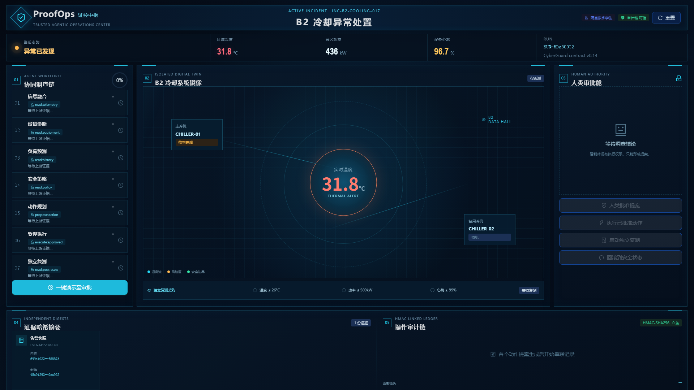
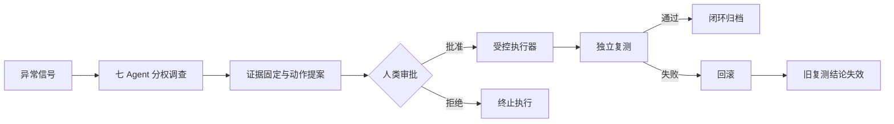

# ProofOps · 证控中枢

[](https://github.com/armaygooser/ProofOps/actions/workflows/ci.yml)
[](https://github.com/elsechord/CyberGuard)
[](frontend/)
[](frontend/)
[](backend/)
[](LICENSE)

> **由 [CyberGuard](https://github.com/elsechord/CyberGuard) 可信智能体治理基座迁移建立的工业中控演示系统。**
> 七个 Agent 负责调查与协作，人类负责最终审批；系统通过证据哈希链、精确审批绑定、独立复测和可验证回滚，让每一步决策都能追踪、校验和撤销。



## 为什么有 ProofOps

CyberGuard 最初面向安全审计：多个智能体分权调查，受控执行器实施动作，独立角色复核结果，并用哈希证据链记录整个决策过程。

ProofOps 将这套治理闭环迁移到工业运维，以 **B2 冷却系统异常** 为演示场景。领域对象从安全告警、主机和响应动作，替换为工业遥测、冷却设备和 BMS 指令；可信决策机制保持一致：



这说明 CyberGuard 的核心价值不局限于网络安全，而是一套可迁移的**高风险智能体决策与执行基座**。

## 从 CyberGuard 迁移了什么

| CyberGuard 治理能力 | ProofOps 工业领域适配 |
|---|---|
| Evidence ID、内容摘要与封装摘要 | BMS 快照和七个 Agent 调查结论分别生成 SHA-256 |
| 七角色权限隔离与分工协作 | 信号融合、设备诊断、负荷预测、安全策略、动作规划、受控执行、独立复测 |
| 高风险动作允许列表 | 只允许 `activate_backup_cooling / B2-CHILLER-02` |
| L2 人工审批 | 值班总管批准，审批记录绑定完整提案哈希并在 15 分钟后过期 |
| HMAC 串联操作审计 | 提案、批准、执行和回滚形成 HMAC-SHA256 操作链 |
| 幂等执行与工具回执 | 数字孪生执行 `BMS.START/BMS.STOP` 并返回可核验回执 |
| 独立 Recovery Verifier | 独立检查温度、功率和设备心跳，三项满足才通过 |
| 回滚关闭语义 | 回滚绑定原执行记录哈希，并立即使旧复测结论失效 |

迁移来源、基线文件和逐项对应关系见 [CyberGuard 基座复用说明](docs/CYBERGUARD_REUSE.md)。

## 60 秒演示流程

1. 点击 **一键演示至审批**，生成 B2 冷却异常、七 Agent 调查结果和动作提案。
2. 查看每条证据的 SHA-256，以及提案所绑定的证据集合。
3. 由值班总管输入身份并批准，系统将批准记录绑定到当前提案哈希。
4. 执行备用冷却启动指令，查看数字孪生回执和新的审计链节点。
5. 运行独立复测，验证温度、功率和心跳是否达到安全阈值。
6. 点击回滚，系统绑定原执行哈希、停止备用设备，并让旧复测结论失效。

整个流程中，Agent 只能调查和形成提案，最终执行权始终由人类掌握。

## 核心能力

- **七 Agent 分权协作**：角色拥有明确职责和最小权限，调查结果独立留痕。
- **Human in the Loop**：高风险动作必须经过人工审批，审批不能复用于其他提案。
- **证据哈希链**：内容摘要、前序记录哈希和 HMAC 鉴真共同保证审计记录可校验。
- **状态机约束**：调查、提案、审批、执行、复测与回滚必须按合法顺序发生。
- **独立复测**：执行者不能自行宣布成功，系统使用独立阶段重新观察设备状态。
- **可验证回滚**：回滚操作指向原执行记录，且会关闭已经失效的成功结论。
- **领域隔离**：工业动作使用 ProofOps 自己的白名单，不修改 CyberGuard 的安全动作边界。

## 一键启动

需要安装并启动 Docker Desktop：

```powershell
git clone https://github.com/armaygooser/ProofOps.git
cd ProofOps
docker compose up --build
```

打开 <http://127.0.0.1:18766>，点击 **一键演示至审批** 即可体验完整闭环。

后端健康检查地址：<http://127.0.0.1:18765/health>。

### 本地开发

需要 Python 3.12+ 和 Node.js：

```powershell
npm --prefix frontend install
python -m venv .venv
.\.venv\Scripts\python.exe -m pip install -e ".[dev]"
```

启动后端：

```powershell
.\.venv\Scripts\python.exe -m uvicorn proofops_api.app:app --host 127.0.0.1 --port 18765
```

另开终端启动前端：

```powershell
npm --prefix frontend run dev -- --host 127.0.0.1
```

## 技术架构

```text
Ant Design 控制台
        │
        ▼
FastAPI 状态机与场景引擎
        │
        ├── CyberGuard 治理契约适配
        │   ├── SHA-256 证据摘要
        │   ├── HMAC 串联审计
        │   ├── 提案与审批精确绑定
        │   └── 回滚关闭语义
        │
        ├── 工业领域包与动作白名单
        └── B2 冷却系统数字孪生
```

| 目录 | 内容 |
|---|---|
| [`frontend/`](frontend/) | React、TypeScript、Ant Design 工业中控页面 |
| [`backend/`](backend/) | FastAPI、治理适配器、状态机和数字孪生 |
| [`domainpack/`](domainpack/) | 工业角色、动作白名单与复测契约 |
| [`agentteams/`](agentteams/) | 七 Worker 草案、权限 Skill 和 Element Web 打开方式 |
| [`docs/`](docs/) | 复用说明、真实性边界、演示脚本和设计记录 |

## 当前复用层级与真实性边界

当前版本是**基于 CyberGuard v0.14 治理契约实现的本地工业适配原型**：

- 实时运行：FastAPI 状态机、SHA-256、HMAC 审计链、审批绑定、审批过期、动作白名单、回滚语义和容器服务。
- 确定性模拟：工业遥测、七 Agent 调查内容、BMS/PLC 设备回执和独立复测环境。
- 当前未运行时调用 CyberGuard 在线 API，也未直接导入 CyberGuard Python 包。
- 当前未连接真实工业设备，AgentTeams Worker 和 Element Web Service Publishing 仍需在比赛环境部署。

这一边界让演示既能证明跨领域迁移可行，也不会把数字孪生描述成生产系统。完整说明见 [演示真实性边界](docs/DEMO_TRUTH_BOUNDARY.md)。

## AgentTeams / Element Web

仓库提供七个 Worker 草案和三个权限隔离 Skill。部署到 AgentTeams Controller 后，可通过 Service Publishing 发布 18766 端口，并从 Element Web 房间打开中控台。

具体步骤见 [Element Web 接入说明](agentteams/ELEMENT_LAUNCH.md)。在获得真实 Worker 和工具回执前，界面中的确定性调查轨迹不会标记为在线模型运行。

## 验证

```powershell
.\.venv\Scripts\python.exe -m pytest
.\.venv\Scripts\python.exe -m ruff check backend
npm --prefix frontend test
npm --prefix frontend run build
```

GitHub Actions 会在每次 push 和 pull request 时运行后端检查、后端测试、前端测试和生产构建。

## 安全说明

默认配置只连接隔离数字孪生，不连接真实 PLC、BMS 或生产设备。若要接入生产环境，需要另外完成设备协议适配、身份与凭据隔离、不可变审计存储、部署审批和现场安全验证。

## License

[Apache License 2.0](LICENSE)
